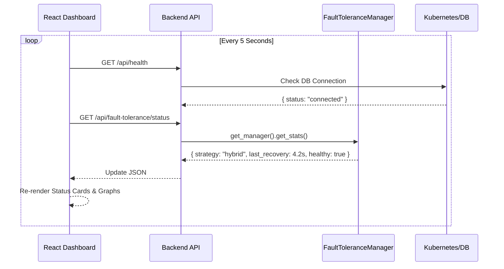
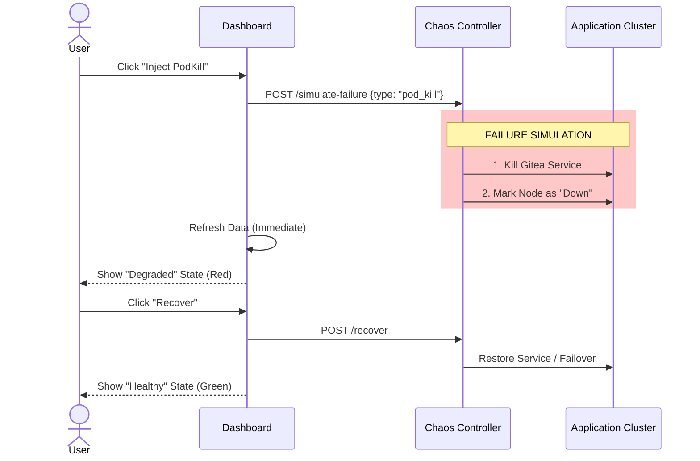

# 📊 System Status Dashboard: Under the Hood

This document visualizes how the **Research Dashboard** (`SystemStatus.jsx`) functions and interacts with the distributed backend.

## 🔄 1. The Monitoring Loop (Live Metrics)

The dashboard maintains a real-time connection to the system state.



### ✅ What You See
*   **"Healthy/Degraded" Badge**: Derived from `ft_status.is_healthy`.
*   **Recovery Timer**: Displays `ft_status.stats.last_recovery_time`.
*   **CockroachDB Status**: Derived from `health_data.components.database`.

---

## ⚙️ 2. Research Control Panel (Configuration)

This panel allows researchers to dynamically switch the fault tolerance algorithm at runtime.

```mermaid
graph LR
    User[User Selects "Replication"] -->|Click Run| UI[Frontend]
    UI -->|POST /run-experiment| API[Backend Router]
    API -->|1. Create Config| FT[FaultManager]
    FT -->|2. Instantiate Strategy| Strat[ReplicationStrategy]
    Strat -->|3. Simulate Ops| Nodes[Virtual Nodes]
    Nodes -->|4. Return Result| API
    API -->|5. JSON Result| UI
    UI -->|6. Show Badge| ResultBadge["Last Run: 1.2s"]
```

### ✅ How it Works
1.  **Select Strategy**: React state (`selectedStrategy`) updates.
2.  **Parameters**: Sliders update `checkpointInterval` state.
3.  **Run Experiment**: Sends a payload to `/run-experiment`.
4.  **Feedback**: The `experimentResult` state displays the measured Recovery Time immediately.

---

## 💥 3. Fault Injection (Chaos Mesh Integration)

Reliability testing requires breaking things.



### ✅ Key Features
*   **Safety**: Triggers controlled logic in `backend/fault_tolerance/` which mimics infrastructure failure without actually destroying your laptop's Minikube cluster (unless mapped to real Chaos Mesh CRDs).
*   **Visual Feedback**: The "Availability" card turns **RED** instantly upon fault injection and **GREEN** after recovery.

---

## 4. Code Map

| Feature | Frontend Component | Backend Router | Python Logic |
| :--- | :--- | :--- | :--- |
| **Live Status** | `fetchSystemData()` | `GET /status` | `FaultToleranceManager.get_stats()` |
| **Experiment** | `handleRunExperiment` | `POST /run-experiment` | `manager.run_experiment()` |
| **Faults** | `handleInjectFault` | `POST /simulate-failure` | `strategy.simulate_failure()` |
